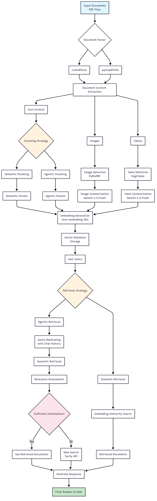

# RAG-based Multimodal Agent

A sophisticated Retrieval-Augmented Generation (RAG) system that combines advanced document processing with intelligent retrieval mechanisms to deliver accurate, context-aware responses from multimodal data sources.

## Table of Contents

- [Overview](#overview)
- [Key Features](#key-features)
- [Installation](#installation)
- [Usage](#usage)
- [API Reference](#api-reference)
- [Contributing](#contributing)
- [License](#license)

## Overview

This project implements an advanced RAG framework that enhances traditional retrieval-augmented generation by introducing **agentic approaches** to both document chunking and information retrieval. Unlike conventional RAG systems that rely on static processing methods, this solution dynamically adapts to complex, multimodal data through intelligent decision-making processes.

### Key Innovations

- **Agentic Chunking**: Simulates human-like document segmentation for optimal content organization
- **Multimodal Processing**: Handles text, images, and tables with specialized extraction and summarization
- **Intelligent Retrieval**: Implements ReAct-based reasoning for contextually appropriate information retrieval
- **Dynamic Adaptation**: Automatically adjusts processing strategies based on content complexity

## Key Features

### 📄 Advanced Document Processing

- **Semantic Chunking**: Splits documents into semantically coherent, meaningful segments
- **Agentic Chunking**: Employs iterative, context-aware segmentation that mimics human judgment
  - Groups sentences based on topic and context
  - Processes documents iteratively from start to finish
  - Optimizes chunk boundaries for maximum semantic coherence
  - [Learn more about Agentic Chunking](https://gleen.ai/blog/agentic-chunking-enhancing-rag-answers-for-completeness-and-accuracy/)

### 🖼️ Multimodal Content Handling

- **Image Detection & Analysis**: Automatically identifies and processes images using PyMuPDF
- **Table Extraction**: Detects and extracts tabular data using img2table
- **Content Summarization**: Generates text descriptions of images and tables using Gemini-1.5-Flash
- **Unified Embedding**: Creates embeddings for all content types using text-embedding-004

### 🔍 Intelligent Retrieval Systems

#### Semantic Retrieval
- Embedding-based similarity search
- Vector database integration
- Context-aware matching

#### Agentic Retrieval (ReAct Process)
1. **Query Rephrasing**: Enhances queries based on chat history context
2. **Semantic Retrieval**: Performs initial information gathering
3. **Relevance Assessment**: Evaluates retrieved content for query relevance and completeness
4. **Dynamic Response**: Generates answers using retrieved documents or web search as needed

## Installation

### Prerequisites

- Python 3.8 or higher
- Git

### Setup Instructions

1. **Clone the repository**
   ```bash
   git clone https://github.com/santiago9631/RAG-based-multimodal-agent.git
   cd RAG-based-multimodal-agent
   ```

2. **Install dependencies**
   ```bash
   pip install -r requirements.txt
   ```

3. **Configure environment variables**
   
   Create a `.env` file in the project root with the following variables:
   ```bash
   LLAMA_CLOUD_API_KEY=your_llamacloud_api_key_here
   GOOGLE_API_KEY=your_google_api_key_here
   TAVILY_API_KEY=your_tavily_api_key_here
   ```

## Usage

### Document Processing

Process your documents using the following command:

```bash
python main.py --InputPath <path> --parser_name <parser> --chunking_strategy <chunking> --retrieval_strategy <retrieval>
```

#### Parameters

| Parameter | Description | Options |
|-----------|-------------|---------|
| `--InputPath` | Path to directory containing files or single file path | Any valid file/directory path |
| `--parser_name` | Document parser to use | `LlamaParse`, `pymupdf4llm` |
| `--chunking_strategy` | Document chunking approach | `semantic`, `agentic` |
| `--retrieval_strategy` | Information retrieval method | `semantic`, `agentic` |

#### Example Usage

```bash
# Process a single PDF with agentic chunking and retrieval
python main.py --InputPath document.pdf --parser_name LlamaParse --chunking_strategy agentic --retrieval_strategy agentic

# Process multiple PDFs in a directory
python main.py --InputPath ./documents/ --parser_name pymupdf4llm --chunking_strategy semantic --retrieval_strategy semantic
```

### Interactive Querying

After processing documents, the system provides an interactive terminal interface for querying:

1. Enter your questions in the terminal
2. Receive contextually relevant answers based on processed content
3. Ask follow-up questions for deeper exploration

**Note**: Currently supports PDF files only. All PDF files in the input directory will be processed automatically.

## API Reference

### Supported File Formats
- **PDF**: Full support with text, image, and table extraction

### Parser Options
- **LlamaParse**: Advanced PDF parsing with enhanced structure recognition
- **pymupdf4llm**: Lightweight PDF processing optimized for LLM integration

### Chunking Strategies
- **Semantic**: Traditional semantic boundary detection
- **Agentic**: Human-like iterative segmentation process

### Retrieval Strategies
- **Semantic**: Vector similarity-based retrieval
- **Agentic**: ReAct-based intelligent retrieval with dynamic adaptation

## Contributing

We welcome contributions! Please feel free to submit issues, feature requests, or pull requests.

## Workflow Diagram

The following diagram illustrates the complete workflow of the RAG-based multimodal agent:



## License

This project is licensed under the MIT License - see the [LICENSE](./LICENSE) file for details.

